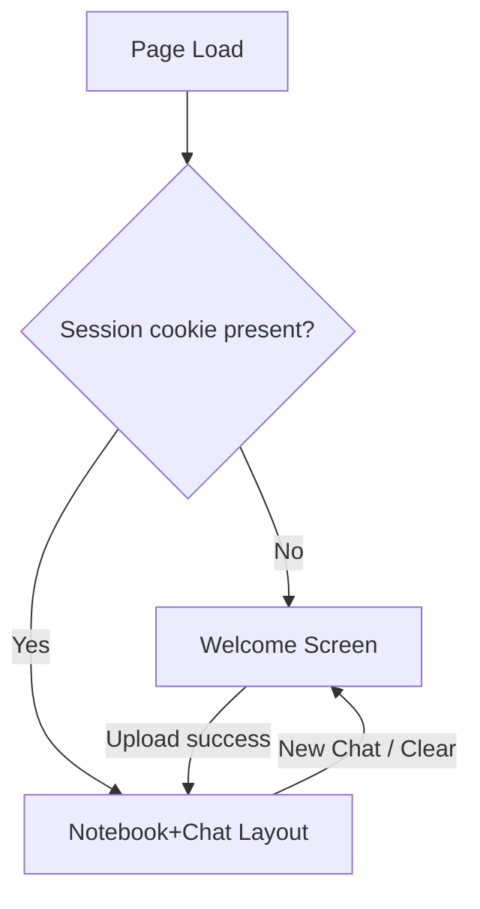
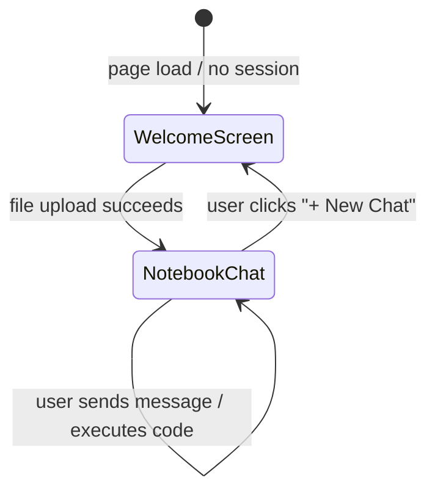
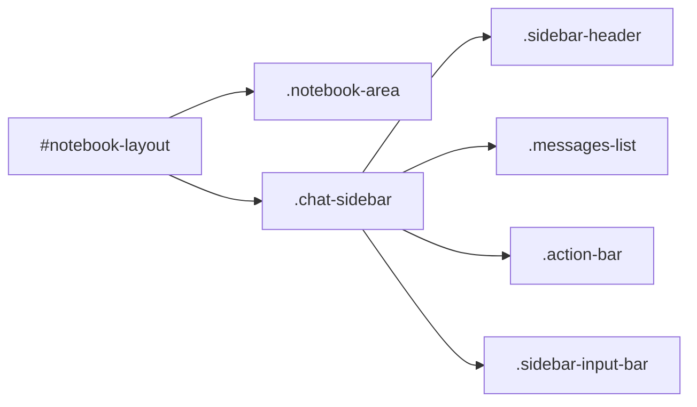
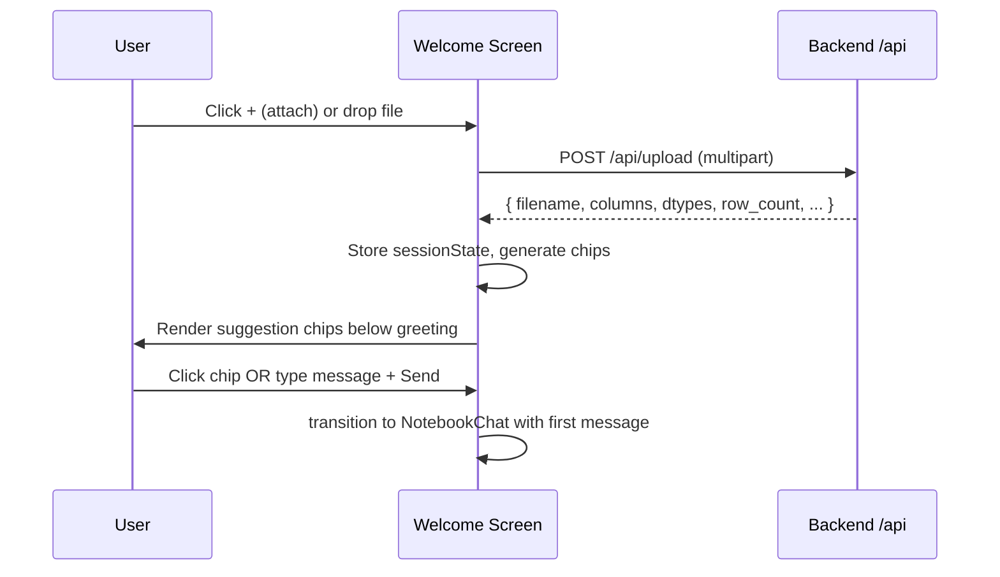
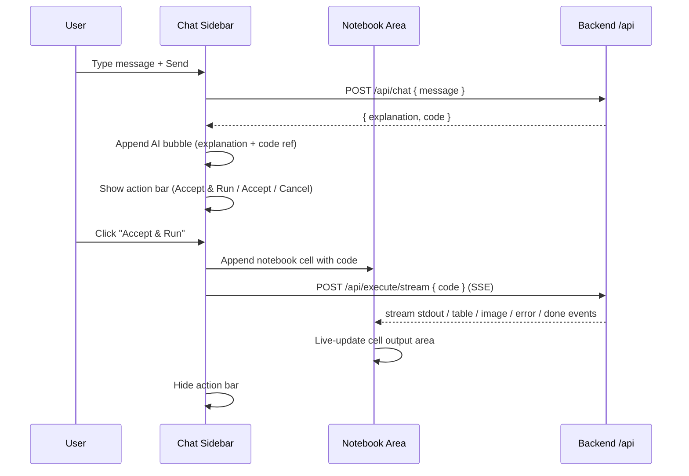

# Design Document: DataNotebook UI Redesign

## Overview

The DataNotebook frontend is being redesigned from a basic two-column dashboard into a polished, two-mode application: a **Welcome Screen** (no active session) and a **Notebook+Chat layout** (active session). The redesign stays as a single `index.html` file with plain HTML, CSS, and JavaScript — no build step, no framework — while dramatically improving the user experience, visual hierarchy, and interaction flow.

The core design shift is from a "form panel + results panel" metaphor to an AI-assistant metaphor familiar from tools like ChatGPT or Cursor, where the chat drives everything and the notebook area shows the outputs.

---

## Architecture

The application has two distinct visual states rendered inside a single `<div id="app">`:



### State Machine



All state transitions are managed by a lightweight vanilla JS state object. No page navigation occurs — views are shown/hidden via CSS classes.

---

## Components and Interfaces

### Component 1: Welcome Screen (`#welcome-screen`)

**Purpose**: Entry point shown before any dataset is loaded. Greets the user, presents dataset-aware suggested prompts after upload, and provides the primary file upload + chat input.

**Interface** (DOM contract):

```
#welcome-screen
  .greeting-area
    h1.greeting          — "Hello, User"
    p.greeting-sub       — "How can I help you today?"
  .suggestions-row       — dynamically populated after upload
    button.chip[data-prompt]  — e.g. "Show summary statistics for df"
  .welcome-input-bar
    button#attach-btn    — opens file picker (+ icon)
    input#welcome-file   — hidden file input
    textarea#welcome-msg — chat input
    button#welcome-send  — send icon button
  .upload-hint           — "Upload a dataset to get started" / error text
```

**Responsibilities**:
- Display greeting with username placeholder ("User" by default, extensible)
- Accept file drop or click-to-upload for CSV/XLSX via the + button
- After upload, call `POST /api/upload`, store session metadata, and render dynamic suggestion chips based on returned `columns`
- On chip click, populate the textarea and auto-focus it
- On send, transition to the Notebook+Chat layout with the first message pre-loaded
- Show inline error/status below the input bar

---

### Component 2: Notebook+Chat Layout (`#notebook-layout`)

**Purpose**: Main working view. Left panel is the notebook canvas (code cells and outputs). Right panel is the chat sidebar.



**Interface** (DOM contract):

```
#notebook-layout
  .notebook-area          — left panel
    .cell-list            — ordered list of code cells + outputs
      .notebook-cell      — individual cell
        .cell-source      — code block (syntax-highlighted)
        .cell-output      — stdout / table / image / error
  .chat-sidebar           — right panel (320px fixed)
    .sidebar-header
      span.sidebar-title  — dataset filename or "DataNotebook"
      button#new-chat-btn — "+ New Chat" icon
      button#menu-btn     — options (⋮)
      button#close-sidebar— × close
    .messages-list        — scrollable chat history
      .msg-bubble.user    — user messages
      .msg-bubble.ai      — AI response (explanation + code chip)
        .msg-explanation  — prose explanation
        .code-ref         — inline code reference spans (highlighted)
    .action-bar           — only shown when latest AI turn has pending code
      button#accept-run   — "Accept & Run"
      button#accept       — "Accept"
      button#cancel-code  — "Cancel"
    .sidebar-input-bar
      button#sidebar-attach — + icon, file upload
      textarea#sidebar-msg  — chat message input
      button#sidebar-send   — send button
```

**Responsibilities**:
- Render each AI response as a chat bubble with explanation text; inline `backtick` spans styled as code chips
- When AI returns code, show the action bar; hide it after user acts
- "Accept & Run" → append a `.notebook-cell` to `.cell-list` with the code, then call `POST /api/execute/stream` and stream output into `.cell-output`
- "Accept" → append cell without executing
- "Cancel" → dismiss the code, hide action bar
- "+ New Chat" → clear session state client-side and transition back to Welcome Screen
- Sidebar close (×) → collapse sidebar, expand notebook to full width
- Preserve conversation history in memory across sends within a session

---

### Component 3: Notification / Status Bar (`#status-bar`)

**Purpose**: Lightweight single-line banner at the top for transient status messages (upload progress, errors, etc.). Fades out automatically after 4s.

---

## Data Models

### Session State (in-memory JS object)

```javascript
sessionState = {
  active: boolean,           // whether a dataset session is open
  filename: string,          // e.g. "titanic.csv"
  dfName: string,            // inferred pandas var name, e.g. "df_titanic"
  columns: string[],         // ["PassengerId", "Survived", "Pclass", ...]
  dtypes: { [col]: string }, // {"Age": "float64", "Sex": "object", ...}
  rowCount: number,
  messages: Message[],       // full conversation history
  pendingCode: string | null // code from latest AI turn awaiting user action
}
```

### Message

```javascript
Message = {
  role: "user" | "ai",
  text: string,       // user's message OR AI explanation
  code: string | null // AI-generated code, if any
}
```

### Suggestion Chips Generation

Chips are generated client-side from `sessionState.columns` and `sessionState.dtypes` after upload:

```
rules:
  - Always add: "Show summary statistics for {dfName}"
  - Find first numeric column  → "Visualize the distribution of '{col}'"
  - Find first categorical col → "Show value counts for '{col}'"
  - If numeric + categorical exist → "Create a plot comparing {numCol} by '{catCol}'"
  - Show at most 4 chips
```

---

## Sequence Diagrams

### Upload + Welcome Screen flow



### Chat + Execute flow



---

## Error Handling

### Scenario 1: Upload failure
- **Condition**: `/api/upload` returns non-2xx
- **Response**: Show error text in `.upload-hint` below input bar; keep Welcome Screen visible
- **Recovery**: User can retry with a different file

### Scenario 2: Chat failure (no session / session expired)
- **Condition**: `/api/chat` returns 401 or 404
- **Response**: Show status-bar banner "Session expired — please re-upload your dataset"; transition back to Welcome Screen
- **Recovery**: User uploads again; new session established

### Scenario 3: Execution streaming error
- **Condition**: SSE `type: "error"` event received
- **Response**: Display error text in the cell's output area with red styling; still show "done" state
- **Recovery**: User can re-run by clicking a "Re-run" icon on the cell

### Scenario 4: No file selected on send
- **Condition**: User clicks send without a file and without an active session
- **Response**: Shake animation on input bar + "Upload a dataset first" hint text
- **Recovery**: User clicks + to attach file

---

## Testing Strategy

### Unit Testing Approach

Key pure functions to unit-test:
- `generateChips(columns, dtypes, dfName)` → correct chip strings for various column combinations
- `inferDfName(filename)` → correct pandas variable name from filename
- `parseSSELine(rawLine)` → correct parse of SSE data lines including malformed input
- `formatExplanation(text)` → backtick spans extracted and wrapped correctly

### Property-Based Testing Approach

**Property Test Library**: fast-check (JavaScript)

Properties to verify:
- For any valid `columns` array, `generateChips` always returns 1–4 chips, never more
- `inferDfName` output is always a valid Python identifier for any non-empty filename input
- `parseSSELine` never throws for arbitrary string input

### Integration Testing Approach

- Playwright or manual smoke test: upload → chip appears → click chip → message populates → send → AI bubble appears → Accept & Run → notebook cell appears with streaming output
- Test session expiry path: clear cookies → send chat → redirect to Welcome Screen

---

## Performance Considerations

- The chat sidebar messages list uses `overflow-y: auto` with a fixed height; long conversations don't reflowed the entire page
- SSE streaming output is appended incrementally to a `<pre>` element; `scrollTop = scrollHeight` is set after each append to auto-scroll
- Suggestion chips are generated synchronously on the client from upload metadata — no extra round-trip
- Images returned via SSE (`type: "image"`, base64 data URI) are inserted directly without a second fetch

---

## Security Considerations

- `session_id` is an httpOnly cookie set by the backend — the JS code never reads or manipulates it directly
- File inputs are restricted to `.csv,.xlsx,.xls` via the `accept` attribute (server validates independently)
- All API calls use `credentials: 'include'` so the cookie is sent automatically
- User-supplied filenames are displayed as text content (`.textContent`) not `.innerHTML` to prevent XSS

---

## Correctness Properties

*A property is a characteristic or behavior that should hold true across all valid executions of a system — essentially, a formal statement about what the system should do. Properties serve as the bridge between human-readable specifications and machine-verifiable correctness guarantees.*

### Property 1: Session gating

*For any* page load state, the Notebook+Chat layout is rendered if and only if a successful `/api/upload` response has been received in the current page session. A page load with no active session always and only shows the Welcome Screen.

**Validates: Requirements 1.1, 1.2, 1.3**

### Property 2: Chip count bound

*For any* non-empty `columns` array and any `dtypes` map and any `dfName` string, `generateChips(columns, dtypes, dfName)` always returns between 1 and 4 chip strings, inclusive. For an empty `columns` array, exactly 1 chip (the summary statistics default) is produced.

**Validates: Requirements 4.1, 4.6**

### Property 3: Chip content correctness

*For any* valid `columns` array, `dtypes` map, and `dfName` string passed to `generateChips`: (a) the summary statistics chip for `dfName` is always present; (b) if a numeric column exists, a distribution chip for the first numeric column is present; (c) if a categorical column exists, a value counts chip for the first categorical column is present; (d) if both exist, a comparison chip is present.

**Validates: Requirements 4.2, 4.3, 4.4, 4.5**

### Property 4: Action bar visibility invariant

*For any* value of `sessionState.pendingCode`, the Action_Bar is visible if and only if `pendingCode` is non-null. After any of the three actions ("Accept & Run", "Accept", "Cancel") are taken, `pendingCode` is set to `null` and the action bar is hidden.

**Validates: Requirements 8.1, 8.2**

### Property 5: No orphaned action bars

*For any* sequence of AI chat responses, there is at most one visible Action_Bar at any given time. When a new AI response with code arrives, the previous `pendingCode` is always discarded and the Action_Bar reflects only the latest AI response.

**Validates: Requirements 8.6**

### Property 6: Cell append monotonicity

*For any* sequence of "Accept" or "Accept & Run" actions of length N, the `.cell-list` contains exactly N cells in the order the actions were taken, and no previously appended cell is removed by the system.

**Validates: Requirements 9.3**

### Property 7: SSE done idempotency

*For any* SSE stream that sends N `"done"` events (N ≥ 1), the effect on application state is identical to receiving exactly 1 `"done"` event. Subsequent `"done"` events produce no additional side effects.

**Validates: Requirements 10.6**

### Property 8: SSE parser never throws

*For any* arbitrary string input, `parseSSELine(rawLine)` never throws an exception. Malformed or non-SSE lines are silently skipped and processing continues.

**Validates: Requirements 13.2, 13.3**

### Property 9: Df name produces valid Python identifier

*For any* non-empty filename string, `inferDfName(filename)` always returns a string that is a valid Python identifier (starts with a letter or underscore, contains only letters, digits, and underscores).

**Validates: Requirements 12.1, 12.2**

### Property 10: XSS safety

*For any* user-controlled string (filename, column name, message text, AI explanation text), the string is always assigned to the DOM via `.textContent` or an equivalent safe API, never via `.innerHTML` or `document.write`.

**Validates: Requirements 14.1, 14.2**

### Property 11: Message history preservation

*For any* sequence of N user messages sent within a single Session, `sessionState.messages` always contains exactly N entries in the order they were sent, and no previously added message is removed.

**Validates: Requirements 7.5**

### Property 12: Explanation formatter wraps all backtick spans

*For any* explanation text string containing backtick-delimited spans, `formatExplanation(text)` returns a DOM structure where every backtick span is wrapped in a `.code-ref` element, and no raw backtick characters remain in the rendered output.

**Validates: Requirements 7.6**

---

## Dependencies

- **No external JS libraries** — vanilla HTML/CSS/JS only
- **No build step** — single `index.html` file
- **Backend APIs** (same origin):
  - `POST /api/upload` — multipart file upload, returns session metadata
  - `POST /api/chat` — JSON body `{ message }`, returns `{ explanation, code }`
  - `POST /api/draw` — JSON body `{ message, save_locally }`, returns `{ image_url, explanation, code }`
  - `POST /api/execute/stream` — JSON body `{ code }`, returns SSE stream
- **Fonts**: Inter via system stack (already in existing CSS, no CDN needed)
- **Icons**: Unicode/emoji characters for +, ×, ⋮, ▶ — no icon library dependency
